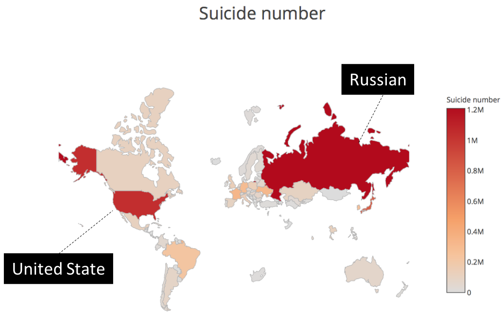
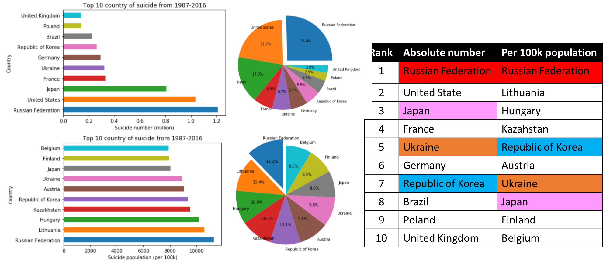

# Suicide rate from 1985 to 2016

## Introduction: 

This is the report about the Suicide rate from 1985 to 2016, the dataset was got from Kaggle website (https://www.kaggle.com/russellyates88/suicide-rates-overview-1985-to-2016), in this dataset, it contains country, year, sex, age, suicide number, population, suicide/100k pop, country-year, HDI for year, gdp_for_year, gdp_per_capita and generation.

From this suicide rate dataset, we can know the trend of the suicide number by year, and also know which generation/age group has the highest suicide number.

In this report, we also compared the suicide number to the other three factors to see is there any correlation between them, we compared the suicide number to GDP (https://data.worldbank.org/indicator/NY.GDP.MKTP.CD), life expectancy (https://www.kaggle.com/kumarajarshi/life-expectancy-who) and happiness score to (http://worldhappiness.report/ed/2017/) find the correlation.

## Conclusion:

•1. The suicide number of the male is higher than female.

•2. The age group has the highest suicide number is 35-54 years.

•3. The country which has the highest suicide number is Russian.

•4. GDP, life expectancy and happiness score do not have a strong correlation with the suicide number.

•5. Happiness score has a strong correlation with life expectancy.

Img.1 Suicide number dispersion of the world  

Img.2 Suicide number by year (in different age group)  

Img.3 Suicide number by gend  

Img.4 Top 10 suicide country  

Img.5 Correlation between four life indexes  

Img.6 The higest correlation  

